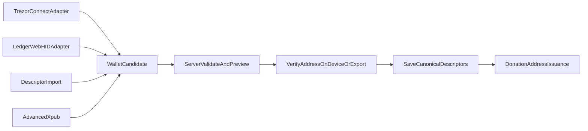

# Harbor Slice 3B — Hardware-Wallet Onboarding

## Goal

An organization can click **Connect hardware wallet**, approve a Trezor or Ledger, verify a receiving address on the device, and connect Harbor without seeing `xpub`, derivation-path, or descriptor terminology. Coldcard/Jade/BitBox-style users get a vendor-neutral descriptor file/text/QR import path; manual xpub remains under **Advanced**.

This slice remains watch-only: Harbor receives public account information, never private keys, and never signs.

## Architecture

Use a small frontend `HardwareWalletAdapter` contract so future BitBox/Jade adapters can join the same pipeline. Persist a canonical single-key Taproot receive descriptor (`tr([fingerprint/path]xpub/0/*)#checksum`) and optional change descriptor, not vendor-specific state.

## Scope and implementation

### 1. Branch, spec, and dependencies

- Work on `slice-3b-hardware-wallets` from current `main`; do not edit this plan file.
- Extend [SPEC.md](SPEC.md) with:
  - **A12 Descriptor wallet:** canonical descriptor persistence, legacy-xpub migration, idempotent reconnect, destructive wallet-change warning.
  - **A13 Hardware onboarding:** vendor-neutral UI, Trezor/Ledger approval, device address verification, import/Advanced fallbacks, no signing/private-key access.
  - **A14 Testnet4:** real Esplora detection and explorer links; mock/Signet/regtest remain green.
- Add current package-manager releases of `@trezor/connect-web`, Ledger’s Device Management Kit + Bitcoin signer + WebHID transport, and a server-side descriptor library that supports Taproot and BIP-380 checksums (prefer `@bitcoinerlab/descriptors`). Add React Testing Library/user-event for component tests. Load vendor SDKs lazily so unsupported browsers can still use Import/Advanced.

### 2. Canonical watch-only wallet model

- Add [server/src/bitcoin/descriptor.ts](server/src/bitcoin/descriptor.ts): parse, validate, checksum, and canonicalize only single-key BIP-86 Taproot receive descriptors for this slice. Reject private keys, non-Taproot scripts, multisig/script trees, wrong network/account depth, and malformed wildcards. Derive the first three preview addresses.
- Update [server/src/db/schema.ts](server/src/db/schema.ts): persist `wallet_descriptor`, optional `wallet_change_descriptor`, `wallet_source`, fingerprint/account metadata, and connection timestamp in settings. On open, migrate an existing `account_xpub` to an equivalent descriptor without clearing issued addresses or donations.
- Same underlying normalized descriptor reconnects must never reset data, even via another source/encoding. A genuinely different wallet clears issued-address and donation state only after the existing confirmation flow.
- Keep the old xpub settings fields/endpoints as compatibility aliases for this slice; Advanced mode routes through descriptor canonicalization.

### 3. Wallet API and issuance

- Refactor [server/src/routes/api.ts](server/src/routes/api.ts):
  - `POST /api/wallet/preview` accepts either account public data from an adapter or a descriptor import, returns canonical metadata plus three addresses, and never persists.
  - `PUT /api/wallet` revalidates and saves the previewed wallet; never trust client-derived addresses.
  - `GET /api/settings` returns connection state/source and preview addresses without exposing the descriptor in the default UI payload; retain legacy fields only for Advanced compatibility.
  - Live public networks (`signet`, `testnet4`) return 409 for on-chain issuance until a non-demo wallet is connected.
- Refactor [server/src/services/issuance.ts](server/src/services/issuance.ts) and [server/src/bitcoin/derivation.ts](server/src/bitcoin/derivation.ts) to derive from the validated receive descriptor while preserving recycling/gap-limit behavior.
- Update [server/src/app.ts](server/src/app.ts) so regtest Core imports the stored canonical descriptor rather than independently rebuilding one from `HARBOR_XPUB`.

### 4. Testnet4 support

- Add `testnet4` to `HarborNetwork` in [server/src/config.ts](server/src/config.ts) and [web/src/lib/api.ts](web/src/lib/api.ts). It shares test-network key/address encoding but remains a distinct chain.
- Parameterize [server/src/bitcoin/esplora.ts](server/src/bitcoin/esplora.ts) so chain labels are not hardcoded; wire Testnet4 to `https://mempool.space/testnet4/api`, 30-second polling, and the existing live-rate provider. Explicit `HARBOR_NETWORK=testnet4` must override hosted mock defaults; Render remains mock by default.
- Add Testnet4 badges, explanatory copy, and explorer links in [web/src/App.tsx](web/src/App.tsx), [web/src/pages/DashboardPage.tsx](web/src/pages/DashboardPage.tsx), and [web/src/pages/DonatePage.tsx](web/src/pages/DonatePage.tsx).

### 5. Vendor-neutral frontend

- Extract the current onboarding card from [web/src/pages/DashboardPage.tsx](web/src/pages/DashboardPage.tsx) into [web/src/components/wallet/ConnectWalletPanel.tsx](web/src/components/wallet/ConnectWalletPanel.tsx).
- Add [web/src/lib/wallet/types.ts](web/src/lib/wallet/types.ts) with an injectable adapter contract returning source, fingerprint, account path, account public key, and a device-address verification method.
- Add adapters:
  - `trezor.ts`: initialize `@trezor/connect-web` from documented Vite manifest environment variables; request the BIP-86 account public key; ask Trezor to display receive address 0 and compare it byte-for-byte with the server preview.
  - `ledger.ts`: feature-detect secure-context WebHID; require the Bitcoin app; use Ledger’s current Bitcoin signer kit to retrieve account public data and display/verify address 0.
  - SDK denial, disconnection, wrong app/network, unsupported browser, and popup errors become plain-language recoverable errors.
- Primary UI: **Connect Trezor**, **Connect Ledger**, **Import watch-only wallet**. Explain: “Harbor can see this donation account but cannot move funds.” Do not show xpub/descriptor/path terminology.
- Import supports UTF-8 text files, pasted descriptor text, JSON containing a standard descriptor field, and a static descriptor QR scanned through the camera. Clearly state that animated BBQr/UR formats and vendor-certified Jade/Coldcard/BitBox direct integrations are future adapters; do not claim support not tested in this slice.
- Move current paste-xpub flow into native `

Advanced setup
`.
- Preserve preview-before-save. Direct adapters additionally require successful address-0 verification on the device; imported/manual wallets require the existing three-address comparison warning.
- Improve [web/src/pages/DonatePage.tsx](web/src/pages/DonatePage.tsx) 409 handling with a link to the dashboard instead of exposing technical API text.

### 6. Testing and documentation

- Descriptor unit tests: canonical checksum, derivation, legacy migration, alternate encodings, rejection of private/non-Taproot/multisig/wrong-network descriptors.
- API/integration tests in [server/src/app.integration.test.ts](server/src/app.integration.test.ts): preview does not persist; same-wallet reconnect preserves ledger; changed wallet resets after confirmation contract; live-network gate; Testnet4 issuance and fixture-driven pending→confirmed detection. No live HTTP in CI.
- Add adapter SDK wrappers with injected/mock transports. Unit-test success, user denial, disconnect, wrong network/app, address mismatch, and unsupported browser without physical devices.
- Add component tests for method selection, Advanced being collapsed by default, preview/save gating, accessible loading/errors, and wallet-change warning.
- `npm run verify` and `git diff --check` must pass.
- Update [README.md](README.md) with plain-language Testnet4 quickstarts for Trezor and Ledger, descriptor-import instructions, browser requirements, Trezor manifest configuration, and an explicit support matrix distinguishing direct, import-only, and planned devices.

## Manual acceptance

1. Start Harbor with `HARBOR_NETWORK=testnet4` and a dedicated DB.
2. In a Chromium browser, connect either a Trezor or Ledger, approve the read-only request, and confirm address 0 matches on the physical device.
3. Save; refresh; confirm Harbor reports the vendor and never displays xpub terminology in the normal flow.
4. Request an on-chain donation address, fund it with Testnet4 faucet coins, and observe pending→confirmed with a working explorer link.
5. Reconnect the same wallet and confirm history remains. Attempt a different wallet and confirm the destructive warning/reset behavior.
6. Import a fixture descriptor file and exercise Advanced manual entry; unsupported browsers must degrade to those paths without breaking the dashboard.

## Out of scope

- Transaction signing or spending; BIP-352/tweak-aware hardware signing; mainnet; direct BitBox/Jade/Coldcard USB adapters; animated BBQr/UR decoding; multisig; mobile/Bluetooth integrations; a local HWI companion app.